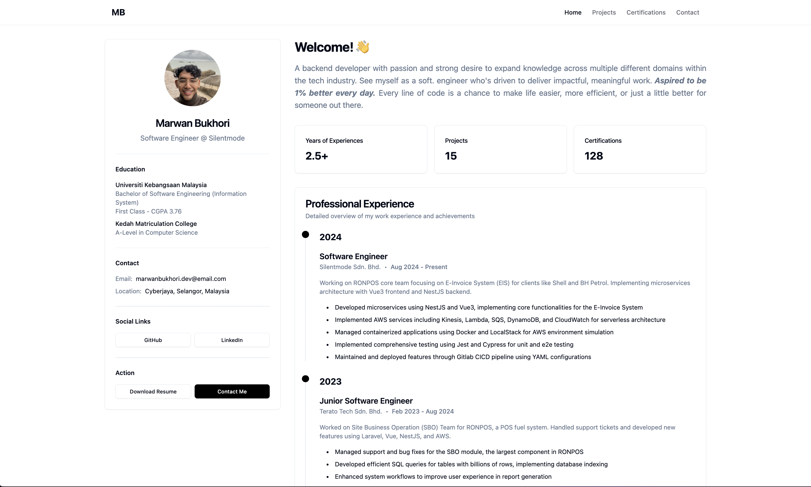

# Personal Portfolio Website

A modern, responsive portfolio website built with Vue 3, TypeScript, and Tailwind CSS.



## 🚀 Features

- Modern UI with Shadcn Vue components
- Responsive design for all devices
- Dark/Light mode support
- Type-safe with TypeScript
- Centralized data management
- Automatic statistics calculation
- SEO friendly

## 🛠️ Tech Stack

- **Frontend Framework:** Vue 3
- **Type System:** TypeScript
- **Styling:** Tailwind CSS
- **UI Components:** Shadcn Vue
- **Build Tool:** Vite
- **Icons:** Lucide Icons

## 📁 Project Structure

```
├── src/
│   ├── components/        # Reusable Vue components
│   │   ├── ui/           # Shadcn Vue components
│   │   └── ...
│   ├── composables/      # Vue composables
│   ├── data/            # JSON data files and documentation
│   ├── views/           # Page components
│   └── ...
├── public/              # Static assets
└── ...
```

## 🔧 Setup and Development

1. Install dependencies:
```bash
npm install
```

2. Start development server:
```bash
npm run dev
```

3. Build for production:
```bash
npm run build
```

## 📊 Data Management

The project uses a centralized data management system for easy maintenance and updates. All content is stored in JSON files under `src/data/`:

- `contact.json`: Contact information and social links
- `projects.json`: Portfolio projects and categories
- `certifications.json`: Professional certifications and skills

For detailed documentation on data management, see [Data Management Documentation](src/data/README.md).

### Key Features of Data Management:

- **Centralized Storage**: All content in JSON files
- **Automatic Calculations**: Project counts, skill totals, etc.
- **Type Safety**: TypeScript interfaces for data structures
- **Easy Updates**: Single source of truth for all content
- **Maintainable**: Clear documentation and structure

## 🔄 Updating Content

1. **Adding Projects**
   - Add new project data to `src/data/projects.json`
   - Statistics update automatically
   - Follow the documented structure

2. **Adding Certifications**
   - Add new certification to `src/data/certifications.json`
   - Skills and platforms update automatically
   - Follow the documented structure

3. **Updating Contact Info**
   - Modify `src/data/contact.json`
   - Update social links and contact details
   - Form configurations available

For detailed instructions, refer to the [Data Management Documentation](src/data/README.md).

## 🎨 Customization

1. **Theme**
   - Modify `src/style.css` for theme variables
   - Dark/Light mode configurations available
   - Custom color schemes supported

2. **Components**
   - Shadcn Vue components in `src/components/ui`
   - Custom components in `src/components`
   - Tailwind CSS utility classes

3. **Layout**
   - Page layouts in `src/views`
   - Responsive design with Tailwind CSS
   - Customizable navigation

## 📝 Notes

- Keep image paths relative to the public directory
- Follow TypeScript type definitions
- Maintain consistent naming conventions
- Update documentation when making structural changes
- Test responsive design on multiple devices

## 📄 License

MIT License - feel free to use this project as a template for your portfolio!

## 🤝 Contributing

Contributions, issues, and feature requests are welcome!
